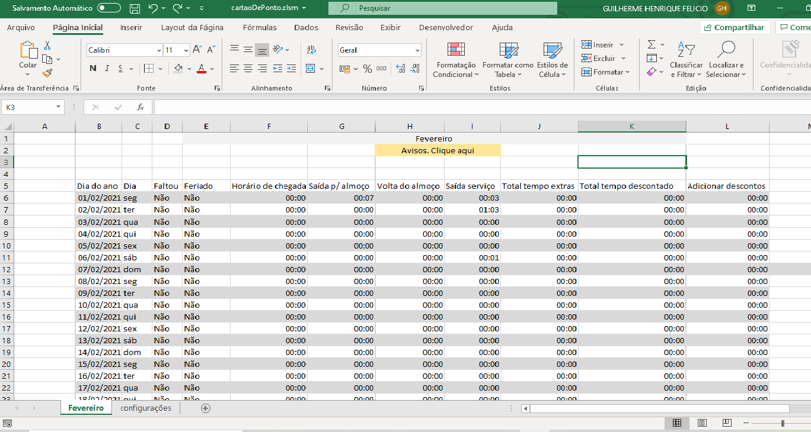

<h1 align="center">
    💻Sistema de cartão de ponto📈</h1>
     
    

<h2>
   ℹ️Sobre
</h2>
⏱️Sistema para cálculo de tempo em cartões de ponto.  
💻Feito totalmente em Excel. 
👷Ainda em Construção🚧

<h2>⚠️Pré-requisitos</h2>
<ul>
    <li>Ter o Microsoft Excel instalado. Caso não tenha, faça o download <a href="https://www.microsoft.com/pt-br/microsoft-365/excel">aqui.</a></li>
</ul>

<h2>⚠🚧Status do sistema</h2>
👷Ainda em Construção

<h2>❓Como baixar</h2>

<ul>
    <li>Você pode fazer o download desse repositório através do Github clicando em: 
    code-> download zip</li>
    <li>Ou também pode clonar esse repositório através do gitbash digitando: 
    git clone https://github.com/Guilherme-Felicio/Sistema-cartao-de-ponto</a></li>
</ul>

Desenvolvido🖤por Guilherme Henrique Felicio

